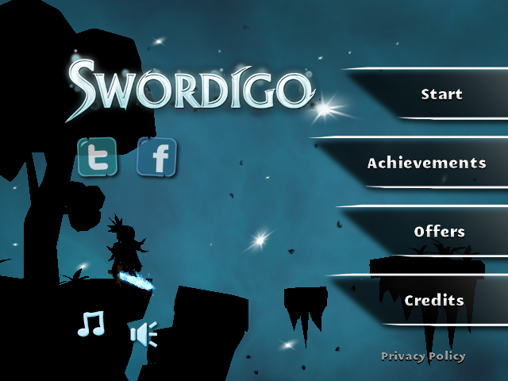
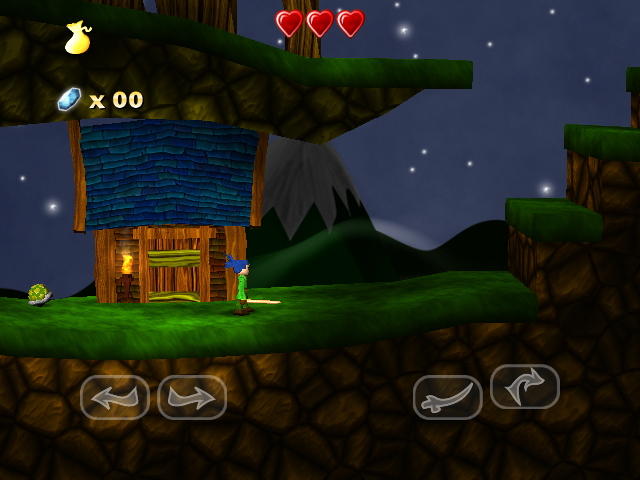

# Swordigo — NextOS / PortMaster universal port

Native **AArch64** port of **Swordigo** (TouchFoo, *Caver* engine, GLES 1.1) for
Linux handhelds. No Android emulation and no translation layer: the game's own
native library runs inside a normal Linux process, and everything Android would
provide — JNI, the asset reader, the music player, lifecycle, preferences and
touch — is served in C. Audio goes through the firmware's OpenAL Soft, the BGM
through mpg123, and video through SDL2 + GLES 1.1.

**This repository ships no game data.** No APK, no assets, no TouchFoo library.
You provide the APK you legally own; the installer validates it and publishes
the data on the device.

|  |  |
|---|---|
|  |  |

*Captured on an R36S at 640×480, by the game's own GPU — that is what the
device drew.*

## Community

Questions, device reports and bug reports: <https://discord.gg/DHfY62eDNN>

A useful report has the device model, the firmware and its version, plus the
`debug.log` and `nxextract.log` that sit next to the port.

## Install

1. Unzip into your **ports** folder, keeping the layout — `Swordigo.sh` and the
   `swordigo/` folder end up side by side in `<ROMS>/ports/`.
2. Drop the APK you legally own into `ports/swordigo/gamedata/`. The name does
   not matter — `.apk`, `.apkm`, `.apks`, `.xapk` and `.zip` all work, and the
   installer identifies the package by content.
3. Launch **Swordigo** from the Ports menu. The first launch extracts and
   validates with a progress screen; later ones go straight to the game.
   **Your APK is never deleted or modified.**

A successful install creates `libswordigo.so`, `assets/` and `res/` inside
`ports/swordigo/`. Full steps, including the per-firmware card paths, in
[`INSTALLATION.md`](INSTALLATION.md).

Updating from 1.0.4 is safe as an overlay and preserves extracted data and
saves. Version 1.0.7 includes a byte-identical compatibility copy for firmware
installers that retain the old launcher's embedded `swordigo` name; every
current launcher still selects `swordigo-nextos`.

Firmware note: on **NextOS / EmuELEC** EmulationStation lists launchers from
`roms/ports_scripts/`, so `Swordigo.sh` also goes there while the game folder
stays at `roms/ports/swordigo/`. On **muOS** the card path is
`mmc/roms/ports` (or `sdcard/roms/ports`). On **ArkOS / ROCKNIX / Knulli /
JELOS** it is plain `roms/ports/`.

### Which APK

| Android package | Validated build | ABI |
|---|---|---|
| `com.touchfoo.swordigo` | **1.4.12** (`1.4.12-47` and one alternative build) | `arm64-v8a` |

That is the build physically tested here — **not a requirement**. The recipe
validates by structure and by content, so a different build of the same game is
accepted without any change to the port. What is refused, with the reason
written to `nxextract.log`, is a package of a different app, a build with no
`arm64-v8a` library, or a file missing what every build of the game has
(`assets/resources`, the `res/*.mp3` music, `lib/arm64-v8a/libswordigo.so`).

An **armeabi-v7a-only** APK cannot work here: the port is AArch64 and the
32-bit library is not interchangeable. A `.xapk`/`.apkm` bundle is fine — the
installer picks the base APK and the `arm64-v8a` split by itself. **Copy the
bundle whole**: unpacking it and copying only the base APK leaves the library
behind, and the installer says exactly that in `nxextract.log`.

## Controls (SDL Xbox layout)

| Input | Action |
|---|---|
| D-pad / left stick | move |
| A | jump |
| X | attack |
| B | magic |
| Y | item |
| LB | magic equip |
| RB | back |
| START | pause / menu |
| Right stick | on-screen cursor |
| R3 | cursor click (touch) |
| SELECT + START | quit |

On many handhelds SELECT, START, L3 and R3 reach the system as
`BTN_TRIGGER_HAPPY1..4`, outside any SDL mapping; the loader reads those codes
straight from evdev, so they work even when the firmware does not declare them.

## Device support

Evidence level, never a promise:

| Device / firmware | State |
|---|---|
| R36S / ArkOS-class (RK3326, Mali-G31, glibc 2.30, 640×480) | **physically validated** — clean install from the ZIP itself, on-device extraction, title, gameplay, audio and music, exit chord, frontend restored |
| NextOS Elite (Amlogic, Mali-450, glibc 2.43) | **physically validated** |
| Other AArch64 CFW with SDL2, OpenAL and GLES 1.1 | plausible, **not tested** |

The public executable is audited at a maximum requirement of `GLIBC_2.27` and
needs only `libSDL2`, `libGLESv1_CM`, `libEGL`, `libopenal`, `libmpg123`, `libz`
and the firmware's libc. No SDL video or audio backend is ever forced.

## Architecture

The original arm64 `libswordigo.so` is loaded by so-loader. Shims: `AAsset` →
`assets/`, a fake JNI (MusicPlayer + lifecycle), OpenAL on the host stack and
GLES 1.1 through SDL2. C++ exceptions need a custom `dl_iterate_phdr` so the
in-binary unwinder can see the `PT_GNU_EH_FRAME` of the mmap'd module, and the
stack canary is anchored in a thread-local pad because the game reads it from
the Bionic TLS slot. `STUDY.md` has the full reverse-engineering notes.

The public package has one launcher chain only:
`Swordigo.sh → swordigo/nxbootstrap.sh → swordigo/swordigo-nextos`. There is no
second-stage `run.sh`. NXExtract 1.2.6 runs as an isolated foreground phase;
the game-specific OpenAL policy stays in the loader adapter rather than in the
generic bootstrap.

Version 1.0.7 also packages a byte-identical `swordigo` compatibility copy for
one-way updates from 1.0.4 installations whose firmware preserves the visible
launcher. It is never selected by the current launcher, is not a second stage,
and is subjected to the same AArch64 and low-glibc gates as the canonical
runtime.

Before SDL opens the display, the bootstrap also checks PortMaster's own live
dialog pipe. If a firmware-specific platform helper returned without closing
that dialog, the bootstrap closes that exact dialog through PortMaster's
official function. It never guesses a firmware name and never kills an
unrelated process. On KMSDRM, the adapter drains the GLES queue before swap;
the opaque-backbuffer operation preserves and restores the game's framebuffer,
colour mask, clear colour and scissor state exactly.

The sanitized v1.0.5 acceptance receipt is in the
[`references/v1.0.5-multi-device-acceptance.json`](https://github.com/NextOs-Ports/swordigo-nextos/blob/v1.0.5/references/v1.0.5-multi-device-acceptance.json)
source record.
It records the package hash and the two available physical regression runs;
confirmation on the original dArkOSRE report remains pending.

## Build

```sh
./build_universal.sh          # -> swordigo-nextos
package/build-package.sh      # public BYO-data zip
```

The cross build runs in a Debian Buster container to hold the glibc ceiling;
SDL2, OpenAL, mpg123, GLES1 and EGL are linked only against SONAME stubs,
because the device firmware is what provides them. The packager re-runs the
launcher test suite and refuses to close the ZIP if the binary asks for more
than `GLIBC_2.30` or is not AArch64.

## Credits and licence

Port code: **GPL-3.0** (see [`LICENSE`](LICENSE)). The bundled NXExtract is MIT
(`licenses/NXExtract-MIT.txt`). Architecture reference: NaGaa95's `swordigo_nx`
(same 1.4.12).

**Swordigo** is a work and trademark of **TouchFoo**. This project is not
affiliated with, sponsored by or endorsed by TouchFoo, and nothing here is
distributed on their behalf — see [`NOTICE.md`](NOTICE.md). Obtain the game
legally.

---

# Português

Port nativo **AArch64** do **Swordigo** (TouchFoo, engine *Caver*, GLES 1.1)
para portáteis Linux. Sem emulação de Android e sem camada de tradução: a
biblioteca nativa do próprio jogo roda dentro de um processo Linux comum, e
tudo o que o Android daria — JNI, leitor de assets, tocador de música, ciclo de
vida, preferências e toque — é servido em C. O áudio sai pelo OpenAL Soft do
firmware, a música pelo mpg123, e o vídeo pelo SDL2 + GLES 1.1.

**Este repositório não contém dado de jogo.** Nenhum APK, nenhum asset, nenhuma
biblioteca da TouchFoo. Quem joga fornece o APK que possui legalmente; o
instalador valida e publica os dados no aparelho.

### Comunidade

Dúvidas, relatos de aparelho e bugs: <https://discord.gg/DHfY62eDNN>

Relato útil traz o modelo do aparelho, o firmware e a versão, mais o
`debug.log` e o `nxextract.log` que ficam ao lado do port.

### Instalar

1. Descompacte na sua pasta **ports**, mantendo o layout — `Swordigo.sh` e a
   pasta `swordigo/` ficam lado a lado em `<ROMS>/ports/`.
2. Coloque o APK que você possui legalmente em `ports/swordigo/gamedata/`. O
   nome não importa — `.apk`, `.apkm`, `.apks`, `.xapk` e `.zip` servem, e o
   instalador reconhece o pacote pelo conteúdo.
3. Abra **Swordigo** pelo menu Ports. A primeira abertura extrai e valida com
   tela de progresso; as seguintes vão direto para o jogo. **O seu APK nunca é
   apagado nem modificado.**

A instalação bem-sucedida cria `libswordigo.so`, `assets/` e `res/` dentro de
`ports/swordigo/`. Passo a passo, com o caminho do cartão de cada firmware, em
[`INSTALLATION.md`](INSTALLATION.md).

No **NextOS / EmuELEC** o EmulationStation lista launcher de
`roms/ports_scripts/`, então o `Swordigo.sh` vai também para lá e a pasta do
jogo fica em `roms/ports/swordigo/`. No **muOS** o caminho é `mmc/roms/ports`
(ou `sdcard/roms/ports`). No **ArkOS / ROCKNIX / Knulli / JELOS** é
`roms/ports/`.

### Qual APK

| Pacote Android | Build validada | ABI |
|---|---|---|
| `com.touchfoo.swordigo` | **1.4.12** (`1.4.12-47` e uma build alternativa) | `arm64-v8a` |

Essa é a build testada fisicamente aqui — **não é exigência**. A receita valida
por estrutura e por conteúdo, então uma build diferente do mesmo jogo é aceita
sem mudar nada no port. O que é recusado, com o motivo escrito no
`nxextract.log`, é pacote de outro aplicativo, build sem biblioteca
`arm64-v8a`, ou arquivo a que falte o que toda build do jogo tem
(`assets/resources`, as músicas `res/*.mp3`, `lib/arm64-v8a/libswordigo.so`).

APK **só armeabi-v7a** não serve: o port é AArch64 e a biblioteca 32-bit não é
intercambiável. Bundle `.xapk`/`.apkm` serve — o instalador escolhe sozinho o
APK base e o split `arm64-v8a`. **Copie o bundle inteiro**: descompactar e
copiar só o APK base deixa a biblioteca para trás, e o instalador diz
exatamente isso no `nxextract.log`.

### Controles (layout Xbox da SDL)

| Botão | Ação |
|---|---|
| D-pad / analógico esquerdo | andar |
| A | pular |
| X | atacar |
| B | magia |
| Y | item |
| LB | equipar magia |
| RB | voltar |
| START | pausa / menu |
| Analógico direito | cursor na tela |
| R3 | clique do cursor (toque) |
| SELECT + START | sair |

Em vários portáteis SELECT, START, L3 e R3 chegam como
`BTN_TRIGGER_HAPPY1..4`, fora de qualquer mapping da SDL; o loader lê esses
códigos direto do evdev, então funcionam mesmo quando o firmware não os declara.

### Aparelhos

Nível de evidência, nunca promessa:

| Aparelho / firmware | Estado |
|---|---|
| R36S / classe ArkOS (RK3326, Mali-G31, glibc 2.30, 640×480) | **validado fisicamente** — instalação limpa a partir do próprio ZIP, extração no aparelho, título, gameplay, áudio e música, atalho de saída, frontend restaurado |
| NextOS Elite (Amlogic, Mali-450, glibc 2.43) | **validado fisicamente** |
| Outros CFW AArch64 com SDL2, OpenAL e GLES 1.1 | plausível, **não testado** |

O executável público é auditado com teto de `GLIBC_2.27` e depende apenas de
`libSDL2`, `libGLESv1_CM`, `libEGL`, `libopenal`, `libmpg123`, `libz` e a libc
do firmware. Nenhum backend SDL de vídeo ou áudio é forçado.

### Arquitetura

O `libswordigo.so` arm64 original é carregado via so-loader. Shims: `AAsset` →
`assets/`, JNI falso (MusicPlayer + ciclo de vida), OpenAL no host e GLES 1.1
pela SDL2. Exceções C++ exigem um `dl_iterate_phdr` custom para o unwinder
embutido enxergar o `PT_GNU_EH_FRAME` do módulo mmapado, e o canário de pilha
fica ancorado num pad thread-local porque o jogo o lê do slot TLS do bionic.
As notas completas de engenharia reversa estão em `STUDY.md`.

O pacote público tem uma única cadeia de lançamento:
`Swordigo.sh → swordigo/nxbootstrap.sh → swordigo/swordigo-nextos`. Não existe
`run.sh` intermediário. O NXExtract 1.2.6 roda como fase isolada em foreground;
a política OpenAL específica do jogo fica no adapter do loader, não no
bootstrap genérico.

A v1.0.7 também inclui uma cópia `swordigo` byte a byte idêntica para atualizar
instalações 1.0.4 em que o firmware preserva o launcher visível. O launcher
atual nunca escolhe essa ponte, que passa pelos mesmos gates AArch64 e de glibc
baixa do runtime canônico.

Antes de a SDL abrir o display, o bootstrap também verifica o pipe vivo do
próprio diálogo do PortMaster. Se um helper específico do firmware retornou sem
fechar esse diálogo, o bootstrap fecha apenas aquele diálogo pela função oficial
do PortMaster. Não escolhe correção pelo nome do firmware nem mata processo
alheio. No KMSDRM, o adapter drena a fila GLES antes do swap; a correção de alpha
preserva e restaura exatamente framebuffer, máscara de cor, clear color e
scissor do jogo.

O recibo sanitizado da v1.0.5 está no registro-fonte
[`references/v1.0.5-multi-device-acceptance.json`](https://github.com/NextOs-Ports/swordigo-nextos/blob/v1.0.5/references/v1.0.5-multi-device-acceptance.json).
Ele registra o hash do pacote e as duas regressões físicas disponíveis; a
confirmação no aparelho dArkOSRE do relato original continua pendente.

### Construir

```sh
./build_universal.sh          # -> swordigo-nextos
package/build-package.sh      # zip público BYO-data
```

A build cruzada roda num container Debian Buster para manter o teto de glibc;
SDL2, OpenAL, mpg123, GLES1 e EGL entram só como stubs de SONAME, porque quem
fornece essas bibliotecas é o firmware. O empacotador roda de novo a suíte de
testes do launcher e se recusa a fechar o ZIP se o binário pedir mais que
`GLIBC_2.30` ou não for AArch64.

### Créditos e licença

Código do port: **GPL-3.0** (veja [`LICENSE`](LICENSE)). O NXExtract embutido é
MIT (`licenses/NXExtract-MIT.txt`). Referência de arquitetura: `swordigo_nx` do
NaGaa95 (mesma 1.4.12).

**Swordigo** é obra e marca da **TouchFoo**. Este projeto não é afiliado,
patrocinado nem endossado pela TouchFoo, e nada aqui é distribuído em nome
deles — veja [`NOTICE.md`](NOTICE.md). Obtenha o jogo legalmente.
